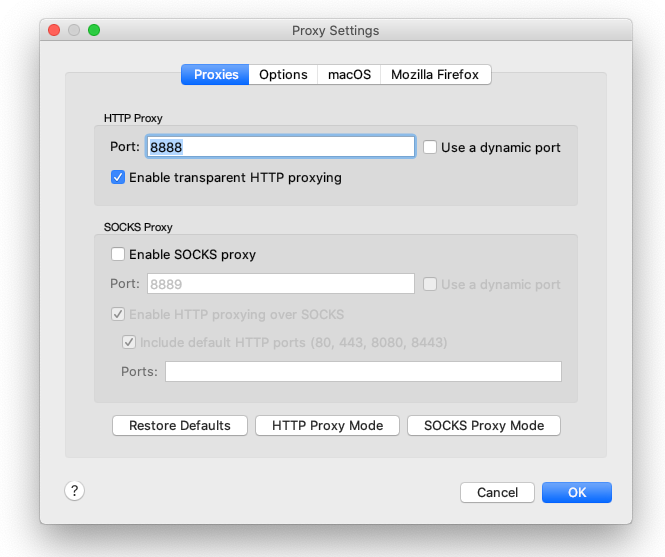
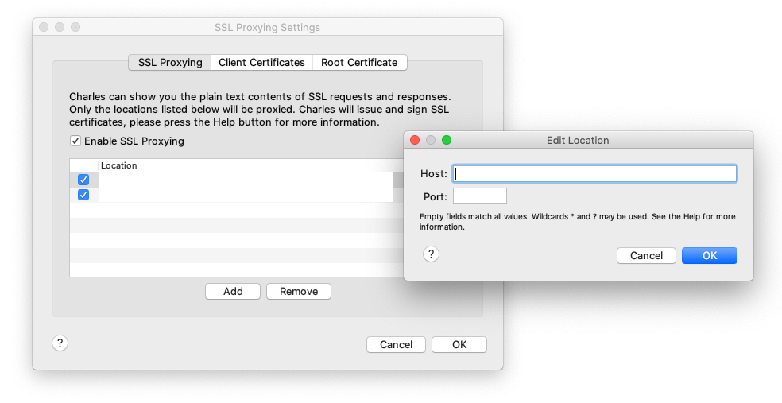
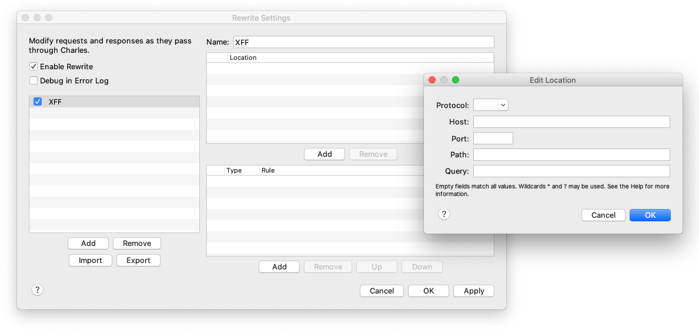
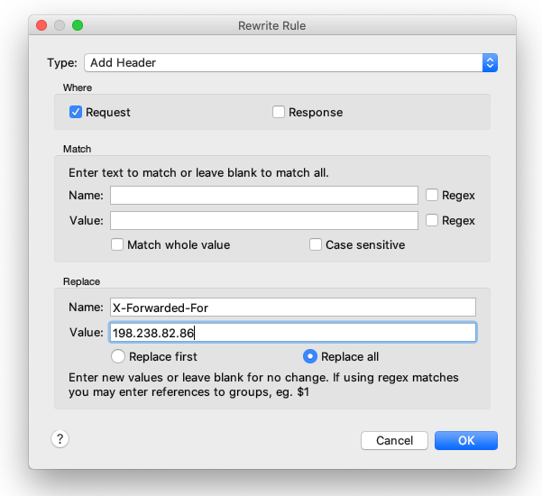
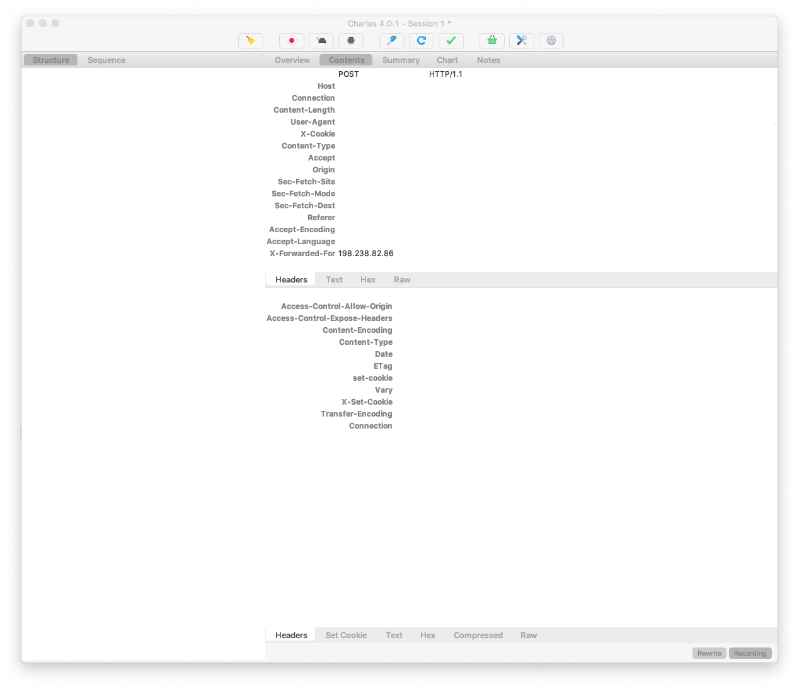

## X-Forwarded-For

### Environment

[Charles](https://www.charlesproxy.com/) v4.0.1

[MaxMind](https://www.maxmind.com/) GeoLite2-City.mmdb

### Background

클라이언트 request 의 ip 와 MaxMind GeoLite2-City 를 이용해서 geo info 를 얻고 있다.

```typescript
import maxmind = require('maxmind');
const cityLookup = maxmind.openSync(dbPath);
const result = cityLookup.get(ip);
```

```
{
  continent: continent.code,
  country: country.iso_code,
  region: subdivisions[0].iso_code,
  city: city.names.en,
  zip: postal.code,
}
```

특정 지역의 유저들에게만 활성화해야하는 기능을 만들고 production 환경에서 테스트를 하려고 하니 쉽지 않았디.

그 지역의 VPN 을 쓰더라도 region 정보가 제대로 나오지 않았다. (시도한 ip: 172.98.86.106)

Charles 로 request 의 `X-Forwarded-For` Header 를 rewrite 해서 해결.

### Confiugration

1. Proxy Settings - **Enable transparent HTTP proxying**

    

2. SSL Proxy Settings - SSL Proxying - **Enable SSL Proxying**

    

3. Rewrite Settings - **Enable Rewrite**. Add Location

    

4. Rewrite Rule: Add Header, Request, Name & Value

    

### Result

Request Header 에 **X-Forwarded-For: 198.238.82.86** 가 추가 되어있음.


