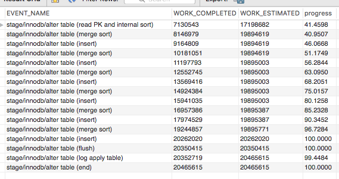

## Monitoring ALTER TABLE Progress for InnoDB Tables

### Environment

MySQL 5.7.22

### Prerequisites

`ALTER TABLE` 이 얼마나 진행 됐는지 알기 위해서는 추가적인 설정이 필요하다.

```sql
UPDATE `performance_schema`.`setup_instruments` SET ENABLED = 'YES' WHERE NAME LIKE 'stage/innodb/alter%';

UPDATE `performance_schema`.`setup_consumers` SET ENABLED = 'YES' WHERE NAME LIKE '%stages%';
```

### Usage

추정된 값으로 진행 상황 파악에 참고 정도로 쓰고 있다.

```sql
SELECT
    EVENT_NAME,
    WORK_COMPLETED,
    WORK_ESTIMATED,
    (WORK_COMPLETED / WORK_ESTIMATED) * 100 AS progress
FROM
    performance_schema.events_stages_current;

SELECT 
    EVENT_NAME,
    WORK_COMPLETED,
    WORK_ESTIMATED,
    (WORK_COMPLETED / WORK_ESTIMATED) * 100 AS progress
FROM
    performance_schema.events_stages_history;
    
SELECT
    EVENT_NAME,
    WORK_COMPLETED,
    WORK_ESTIMATED,
    (WORK_COMPLETED / WORK_ESTIMATED) * 100 AS progress
FROM
    performance_schema.events_stages_history_long;
```

### Stage

아래 순서대로 7개의 stage 가 존재한다.

- stage/innodb/alter table (read PK and internal sort)

- stage/innodb/alter table (merge sort)

- stage/innodb/alter table (insert)

- stage/innodb/alter table (log apply index)

- stage/innodb/alter table (flush)

- stage/innodb/alter table (log apply table)

- stage/innodb/alter table (end)

모든 `index` 에 대해 `merge sort/insert` 가 진행되기 때문에, 필요 없는 index 는 제거해야 `ALTER TABLE` 이 빨라진다.

### Example

[MySQL Workbench](https://www.mysql.com/products/workbench/) 를 이용한 `ALTER TABLE` 모니터링



### Reference

https://dev.mysql.com/doc/refman/5.7/en/monitor-alter-table-performance-schema.html
