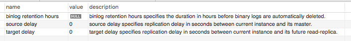
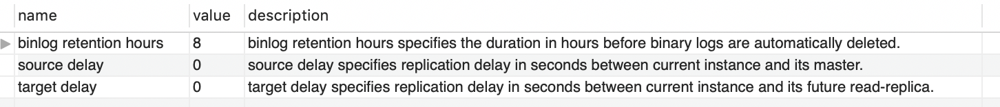
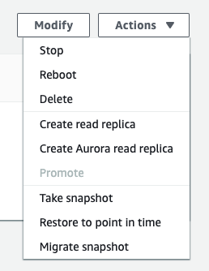
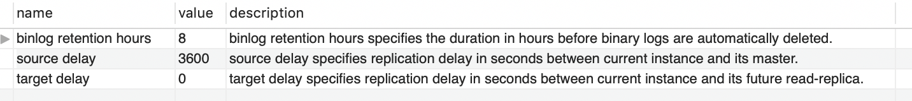
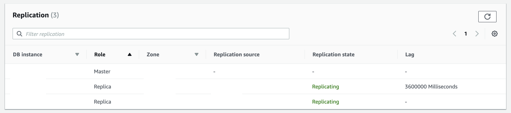

## Delayed Replication

### Background

장애 발생 했을 때 AWS 가 자체적으로 제공하는 **PITR (point in time recovery)** 기능은 

**Multi AZ** + **비효율적으로 많은 Write** (지금은 리팩토링 완료) 환경에서는 사용하지 못할 정도의 성능을 보였다.

가장 가까운 스냅샷으로 새로운 인스턴스를 띄운 후 복구를 원하는 시간까지의 binlog 를 순서대로 적용하여 해당 시각의 DB 를 만들어내는 방식인데 1시간 정도의 로그 데이터를 적용하는데 2시간 이상 걸리는 문제가 있었다. (~~최악의 경우 48 시간~~)

그래서 RDS 를 빠르게 복구할 수 있는 방법을 찾다 보니, 2018년 8월 6일부터 [delayed replication](https://aws.amazon.com/about-aws/whats-new/2018/08/amazon-rds-mysql-now-supports-delayed-replication/) 기능이 추가 되었다.

read replica 를 master 와 x초 delay 로 동기화 시키고, 장애가 발생한 시점이 x초 이내에 있다면

그 replica 를 이용해 빠르게 장애 시점 직전으로 복구가 가능할 것이라 생각했다.

### Prerequisites

**MySQL 5.6.40 or 5.7.22 or later**

### Action

1. master 에 [MySQL Binary Logs](https://docs.aws.amazon.com/AmazonRDS/latest/UserGuide/USER_LogAccess.Concepts.MySQL.html#USER_LogAccess.MySQL.Binarylog) 보관

    ```sql
    call mysql.rds_show_configuration;
    ```

    

    ```sql
    call mysql.rds_set_configuration('binlog retention hours', 8);
    ```

    

2. read replica 생성

    

3. replica delay 설정

    ```sql
    call mysql.rds_stop_replication;

    call mysql.rds_set_source_delay(3600);

    call mysql.rds_start_replication;
    ```

    

4. replica lag 확인

    

### Reference

- https://aws.amazon.com/ko/blogs/database/recover-from-a-disaster-with-delayed-replication-in-amazon-rds-for-mysql/
