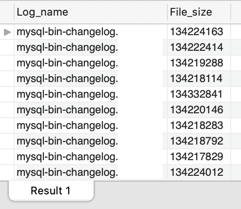
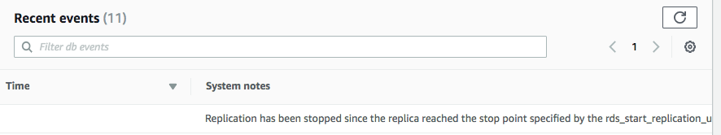

## MySQL Binary Logs

### Background

PITR (point in time recovery) 이 느려서, 2018 4Q 기준 장애 대비 시나리오를 연습 했는데 복구까지 시간은 오래 걸리지 않았다.

이걸 쓰는 일이 발생하지 않았으면 🙃

### Scenario

1. Disaster

    ```sql
    DROP TABLE `database_name`.`table_name`;
    ```

2. Stop delayed read replica

    ```sql
    call mysql.rds_stop_replication;
    ```

3. Find binary logs

    ```sql
    SHOW BINARY LOGS;
    ```

    

4. Access MySQL binary logs

    ```sh
    mysqlbinlog \
      --read-from-remote-server \
      --host=127.0.0.1 \
      --port=3306  \
      --table_name slots \
      --password \
      --raw \
      --result-file=/tmp/ \
      mysql-bin-changelog.123456
    ```

5. Extract from binary logs

    ```
    mysqlbinlog \
      --verbose \
      --base64-output=DECODE-ROWS \
      --database="database_name" \
      --start-datetime="20XX-XX-XX YY:YY:YY" \
      --stop-datetime="20XX-XX-XX ZZ:ZZ:ZZ" \
      mysql-bin-changelog.123456 > binlog.sql
    ```

6. Find location

    ```
    # at 200159
    #XXXXXX YY:YY:YY server id 1234567789  end_log_pos 200190 CRC32 0x04e06e56 | Xid = 1132517
    COMMIT/*!*/;
    
    # at 200190
    #XXXXXX YY:YY:YY server id 1234567789  end_log_pos 200255 CRC32 0x2b61654f | Anonymous_GTID| last_committed=27|sequence_number=28| rbr_only=no
    SET @@SESSION.GTID_NEXT= 'ANONYMOUS'/*!*/; 

    # at 200255
    #XXXXXX YY:YY:YY server id 1234567789  end_log_pos 200382 CRC32 0x4c95893b | Query|thread_id=987|exec_time=0|error_code=0
    use `database_name`/*!*/; 
    SET TIMESTAMP=1582724262/*!*/;
    SET @@session.sql_mode=1073741824/*!*/;
    /*!\C utf8 *//*!*/;
    SET @@session.character_set_client=33,@@session.collation_connection=33,@@session.collation_server=8/*!*/;
    DROP TABLE `table_name` /* generated by server */
    /*!*/;
    SET @@SESSION.GTID_NEXT= 'AUTOMATIC' /* added by mysqlbinlog */ /*!*/;
    DELIMITER ;
    # End of log file
    ```

7. Set your replication delay to zero

    ```sql
    rds_set_source_delay(0);
    ```

8. Start replication until it reaches your location in your binary log file

    ```sql
    call mysql.rds_start_replication_until('mysql-bin-changelog.123456', 200190);
    ```

9. Wait for the RDS Event

    > "Replication has been stopped since the replica reached the stop point specified by the rds_start_replication_until stored procedure. Use rds_start_replication to resume replication."

    

10. Connect to the replica and verify that all changes

    - Check **Relay_Master_Log_File** & **Exec_Master_Log_Pos**.

        ```sql
        SHOW SLAVE STATUS;
        ```
    
    - Find restored table.

        ```sql
        SHOW TABLES;
        ```

11. Promote read replica

### Reference

-  [Recover from a disaster](https://aws.amazon.com/ko/blogs/database/recover-from-a-disaster-with-delayed-replication-in-amazon-rds-for-mysql/)
