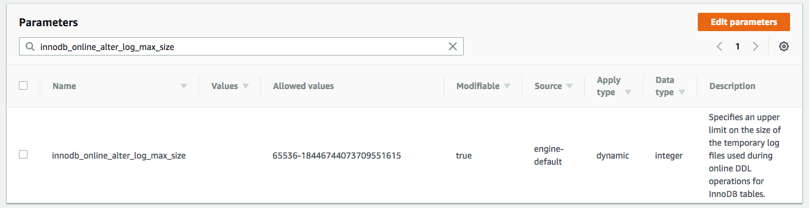
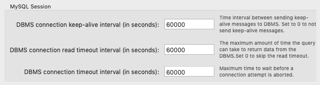

## Online DDL

### Background

`ALTER TABLE` 할 때 마다 점검을 하는 것이 부담스럽기 때문에 `High availability` 를 위해 사용하고자 한다.

### Troubleshooting 1

```sql
ALTER TABLE `xxxx`.`yyyy` 
ADD COLUMN `zzzz` DOUBLE UNSIGNED NOT NULL DEFAULT 0,
ALGORITHM=INPLACE, LOCK=NONE;
```

MySQL Online DDL 을 이용해서 ALTER 를 시도했지만 에러가 발생.

```
Error Code: 1799.
Creating index ‘FTS_DOC_ID_INDEX’ required more than ‘innodb_online_alter_log_max_size’ bytes of modification log.
Please try again. 437.140 sec
```

이유는 ALTER 가 진행되는 동안 DML 들을 별도의 메모리 공간에 저장해 두는데, 최대 크기인 `innodb_online_alter_log_max_size` 를 넘어서였다.

AWS RDS 의 `parameter group` 에 설정되어 있는 [innodb_online_alter_log_max_size](https://dev.mysql.com/doc/refman/5.7/en/innodb-parameters.html) 의 default 값은 `128M` 이다.

Type 이 `dynamic parameter` 이기 때문에 AWS console 에서 바로 수정할 수 있고, Values 는 `2G (2147483648)` 로 했었다.



### Troubleshooting 2

[MySQL Workbench](https://www.mysql.com/products/workbench/) 를 이용해서 시도 했는데 또 실패.

```
Error Code: 2013. Lost connection to MySQL server during query    599.982 sec
```

원인은 Workbench 의 `DBMS connection timeout interval` 기본 값이 10분 (=600s) 로 되어 있어서였고, 넉넉하게 수정해서 성공.



### Reference

- https://dev.mysql.com/doc/refman/5.7/en/innodb-online-ddl.html

- http://small-dbtalk.blogspot.com/2014/09/
