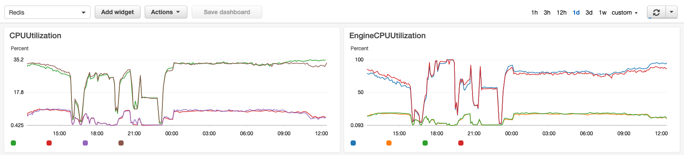

## Redis

### Environment

Redis 3.2.4

Amazon ElastiCache (cache.m4.xlarge)

### Background

`Redis` 부하 문제로 서비스에 장애가 발생.

### EngineCPUUtilization

평소에 `CloudWatch` 대시보드에서 `CPUUtilization` 를 모니터링 하고 있음에도 불구하고, Redis 에 부하가 있다는 것을 인지하지 못했다.



`EngineCPUUtilization` 이라는 Metric 를 보고 나니, 상당한 workloads 가 있었음을 파악.

```
Provides CPU utilization of the Redis engine thread.
Since Redis is single-threaded, you can use this metric to analyze the load of the Redis process itself.
The EngineCPUUtilization metric provides a more precise visibility of the Redis process and can be used in conjunction with CPUUtilization metric, which exposes CPU utilization for the server instance as a whole, including other operating system and management processes.
For larger node types with 4vCPUs or more, use the EngineCPUUtilization metric to monitor and set thresholds for scaling.
For smaller node types with 2vCPUs or less, use the CPUUtilization metric.
```

### SLOWLOG

[slowlog](https://redis.io/commands/slowlog) 로 분석하다 보니 `keys` command 가 문제임을 발견하고 query 문 수정 & 제거.

```
127.0.0.1:46381> slowlog get 200
 1) 1) (integer) 167777
    2) (integer) 1582038308
    3) (integer) 865990
    4) 1) "keys"
       2) "xx:*:xxxx:*:xxxxxx"
 2) 1) (integer) 167776
    2) (integer) 1582038305
    3) (integer) 909420
    4) 1) "keys"
       2) "xx:*:xxxx:*:xxxxxx"
```

```
1) A unique progressive identifier for every slow log entry.
2) The unix timestamp at which the logged command was processed.
3) The amount of time needed for its execution, in microseconds.
4) The array composing the arguments of the command.
```

### Reference

- https://docs.aws.amazon.com/AmazonElastiCache/latest/red-ug/CacheMetrics.Redis.html
