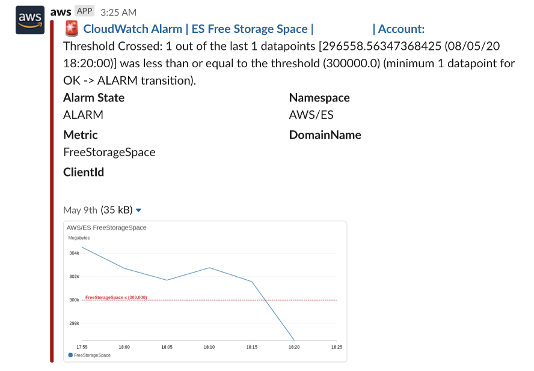

## Index Management

### Environment

AWS Elasticsearch version 7.4

Service software release R20200522

### Background

ES 의 오래된 Index 를 Lambda 에서 Regex 를 이용해서 제거하고 있었는데,

Index 의 이름이 바뀌거나 Daily 에서 Weekly 로 됐을 때 제대로 동작하지 않아서 FreeStorageSpace 문제가 발생.



### ISM (Index State Management)

[AWS ES 업데이트](https://aws.amazon.com/about-aws/whats-new/2020/03/automate-index-management-with-amazon-elasticsearch-service/) 이후 추가 된 [ISM](https://opendistro.github.io/for-elasticsearch-docs/docs/ism/) 를 이용.

#### Set up policies

1. Choose the Index Policies tab.

2. Choose Create policy.

3. In the Name policy section, enter a policy ID.

4. In the Define policy section, enter your policy.

5. Choose Create.

```json
{
  "policy": {
    "policy_id": "delete_index_after_14days",
    "description": "A simple policy that deletes index after N days.",
    "schema_version": 1,
    "default_state": "hot",
    "states": [
      {
        "name": "hot",
        "actions": [],
        "transitions": [
          {
            "state_name": "delete",
            "conditions": {
              "min_index_age": "14d"
            }
          }
        ]
      },
      {
        "name": "delete",
        "actions": [
          {
            "delete": {}
          }
        ],
        "transitions": []
      }
    ]
  }
}
```

#### Attach policies to indices

1. Choose Indices.

2. Choose the index or indices that you want to attach your policy to.

3. Choose Apply policy.

4. From the Policy ID menu, choose the policy that you created. You can see a preview of your policy.

5. If your policy includes a rollover operation, specify a rollover alias. Make sure that the alias that you enter already exists. For more information about the rollover operation, see rollover.

6. Choose Apply.

#### Manage indices

1. Choose Managed Indices.

2. To change your policy, see Change Policy.

3. To attach a rollover alias to your index, select your policy and choose Add rollover alias. Make sure that the alias that you enter already exists. For more information about the rollover operation, see rollover.

4. To remove a policy, choose your policy, and then choose Remove policy.

5. To retry a policy, choose your policy, and then choose Retry policy.

### Template

Kibana 로는 이미 Index 가 존재하는 경우에만 policy 를 적용할 수 있지만, 

[Add policy at index creation](https://opendistro.github.io/for-elasticsearch-docs/docs/ism/api/#add-policy-at-index-creation) 를 참고해 **settings.opendistro.index_state_management.policy_id** 를 template 에 추가하면 된다.

```
PUT _template/TEMPLATE_NAME
{
  ...
  "settings": {
    "opendistro.index_state_management.policy_id": POLICY_ID
  },
  ...
}
```
