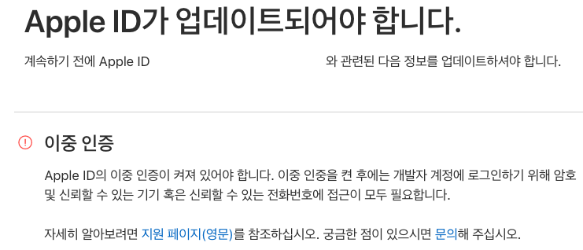

## iOS 2FA

### Troubleshooting

Fastlane 을 업그레이드 했을 때 쯤 (2.114 -> 2.119) 빌드 파이프라인에서 이상한 에러가 발생 했다.

```
undefined method 'strip' for nil:NilClass (NoMethodError)
```

2.114 로 버전을 내리기도 하고 무슨 에러인지 한참 헤메면서 삽질했지만

로그를 자세히 살펴보니 `two_step_or_factor_client.rb` 를 보고 iOS 2FA 가 원인이라고 판단 했다.

```
/Users/XXXXX/.fastlane/bin/bundle/lib/ruby/gems/2.2.0/gems/highline-1.7.8/lib/highline/question.rb:413:in `remove_whitespace': [!] undefined method `strip' for nil:NilClass (NoMethodError)
	from /Users/XXXXX/.fastlane/bin/bundle/lib/ruby/gems/2.2.0/gems/highline-1.7.8/lib/highline.rb:873:in `get_line'
	from /Users/XXXXX/.fastlane/bin/bundle/lib/ruby/gems/2.2.0/gems/highline-1.7.8/lib/highline.rb:891:in `get_response'
	from /Users/XXXXX/.fastlane/bin/bundle/lib/ruby/gems/2.2.0/gems/highline-1.7.8/lib/highline.rb:264:in `ask'
	from /Users/XXXXX/.fastlane/bin/bundle/lib/ruby/gems/2.2.0/gems/fastlane-2.119.0/spaceship/lib/spaceship/two_step_or_factor_client.rb:128:in `handle_two_factor'
	from /Users/XXXXX/.fastlane/bin/bundle/lib/ruby/gems/2.2.0/gems/fastlane-2.119.0/spaceship/lib/spaceship/two_step_or_factor_client.rb:20:in `handle_two_step_or_factor'
	from /Users/XXXXX/.fastlane/bin/bundle/lib/ruby/gems/2.2.0/gems/fastlane-2.119.0/spaceship/lib/spaceship/client.rb:494:in `send_shared_login_request'
	from /Users/XXXXX/.fastlane/bin/bundle/lib/ruby/gems/2.2.0/gems/fastlane-2.119.0/spaceship/lib/spaceship/tunes/tunes_client.rb:127:in `send_login_request'
	from /Users/XXXXX/.fastlane/bin/bundle/lib/ruby/gems/2.2.0/gems/fastlane-2.119.0/spaceship/lib/spaceship/client.rb:769:in `do_login'
	from /Users/XXXXX/.fastlane/bin/bundle/lib/ruby/gems/2.2.0/gems/fastlane-2.119.0/spaceship/lib/spaceship/client.rb:384:in `login'
	from /Users/XXXXX/.fastlane/bin/bundle/lib/ruby/gems/2.2.0/gems/fastlane-2.119.0/spaceship/lib/spaceship/client.rb:346:in `login'
	from /Users/XXXXX/.fastlane/bin/bundle/lib/ruby/gems/2.2.0/gems/fastlane-2.119.0/spaceship/lib/spaceship/tunes/spaceship.rb:24:in `login'
	from /Users/XXXXX/.fastlane/bin/bundle/lib/ruby/gems/2.2.0/gems/fastlane-2.119.0/fastlane/lib/fastlane/actions/app_store_build_number.rb:23:in `get_build_number'
```

### Two Factor Auth

[February 27, 2019](https://developer.apple.com/news/?id=02202019a) 이후로 Apple 의 2FA 가 강제가 되었다.



이중 인증만 설정 했더니 CI machine 에서 문제가 발생하였고, [Fastlane docs](https://docs.fastlane.tools/best-practices/continuous-integration/#two-step-or-two-factor-auth) 를 따라 적용 했다.

#### `Application specific passwords`

appleid.apple.com/account/manage 에서 발급 받아 environment variable 에 추가.

```
Your app-specific password is:
XXXX-XXXX-XXXX-XXXX
Enter this password into the password field of the app you would like to sign in to. Password is case-sensitive. 
```

#### `spaceauth`

```
fastlane spaceauth -u user@email.com
```

`~/.fastlane/spaceship/[email]/cookie` 에 session 이 저장 되는데 한 달 정도 유효 하다고 하다.

주기적으로 manual authentication 을 진행하는데, 자동화를 어떻게 할 지 고민이다.
