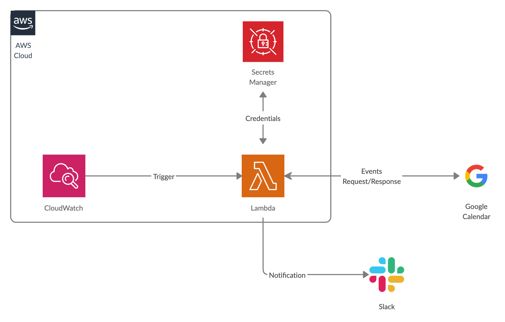

## Google APIs

### Background

구글 캘린더의 이벤트를 읽어와서 필요한 로직을 수행하고 슬랙으로 메세지를 보내는 Lambda 가 필요.

### Prerequisite

#### Authentication and authorization

[Service account credentials](https://github.com/googleapis/google-api-nodejs-client#service-account-credentials) 를 이용.

[Google API Dashboard](https://console.developers.google.com/apis/dashboard) 에서 Organization 밑에 project (GoogleCalendar) 를 생성.

Dashboard - (APIs & Services) - ENABLE APIS AND SERVICES 에서  **Google Calendar API (Integrate with Google Calendar using the Calendar API)** 를 추가.

Credentials - Create credential 에서 **service account** 를 생성.

Keys - Create new key 로 **key pair** 를 발급 & JSON 으로 저장한 뒤 [AWS Secret Manager](https://aws.amazon.com/secrets-manager/) 에 보관.

#### Google Calendar Permission

위에서 발급 받은 **service account (xxxx@yyyy-zzzz-123456.iam.gserviceaccount.com)** 를 원하는 캘린더에 접근할 수 있게 View 권한으로 추가.

### Architecture



```javascript
const AWS = require('aws-sdk');
const { google } = require('googleapis');
const calendar = google.calendar('v3');

const client = new AWS.SecretsManager({
  region: REGION,
});

client.getSecretValue({ SecretId: SECRET_NAME }, function (err, data) {
  ...
  const auth = new google.auth.GoogleAuth({
    credentials: secret,
    scopes: [
      'https://www.googleapis.com/auth/calendar',
    ],
  });

  google.options({
    auth: auth,
  });

  calendar.events.list({
    calendarId: CALENDAR_ID,
  }, function (err, res) {
    ...
  });
});
```
