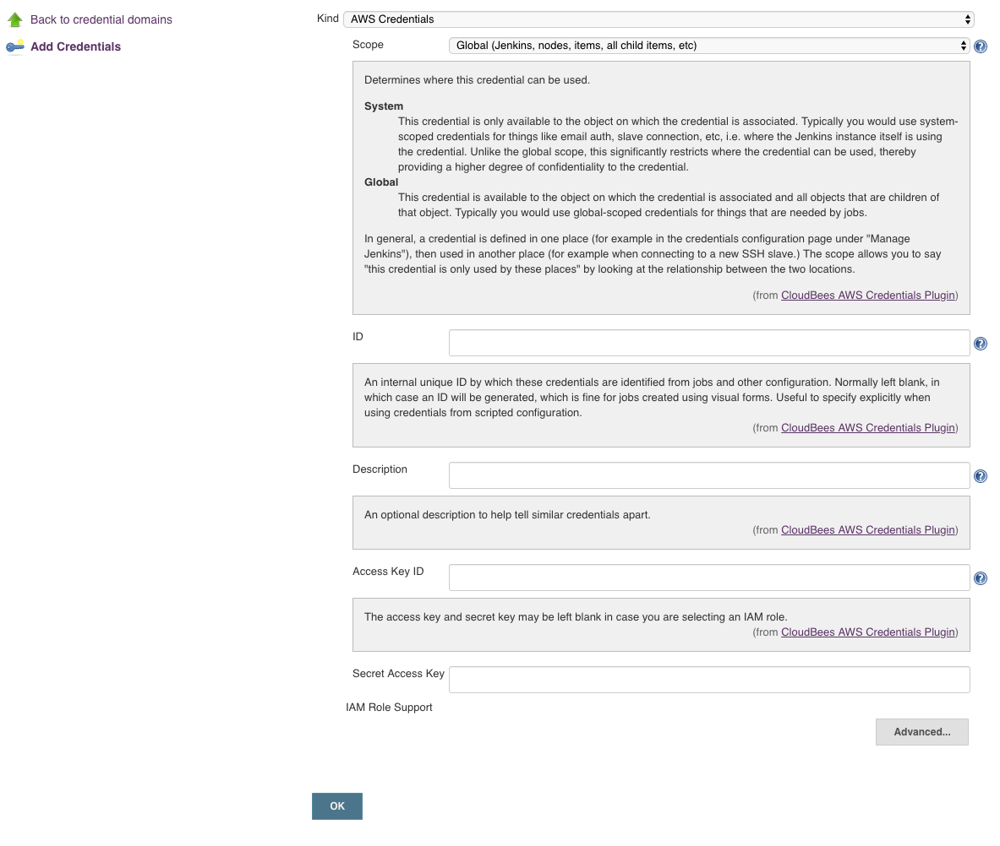
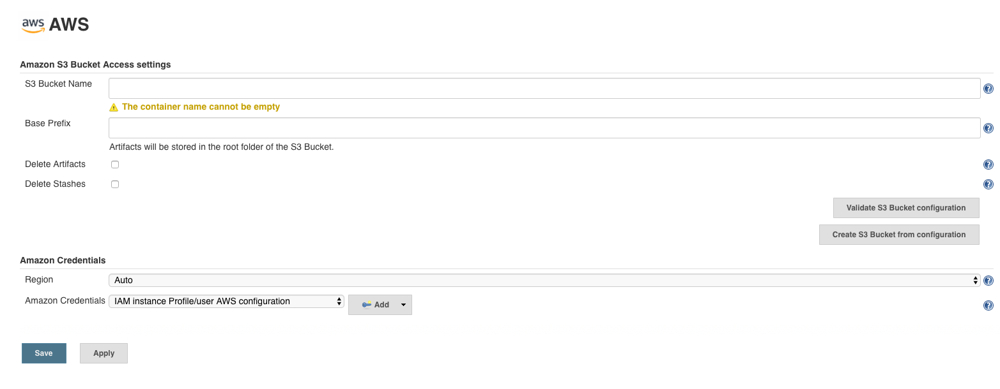
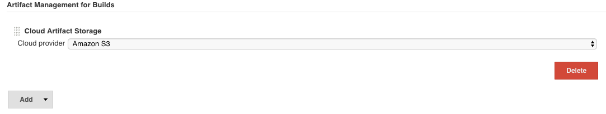
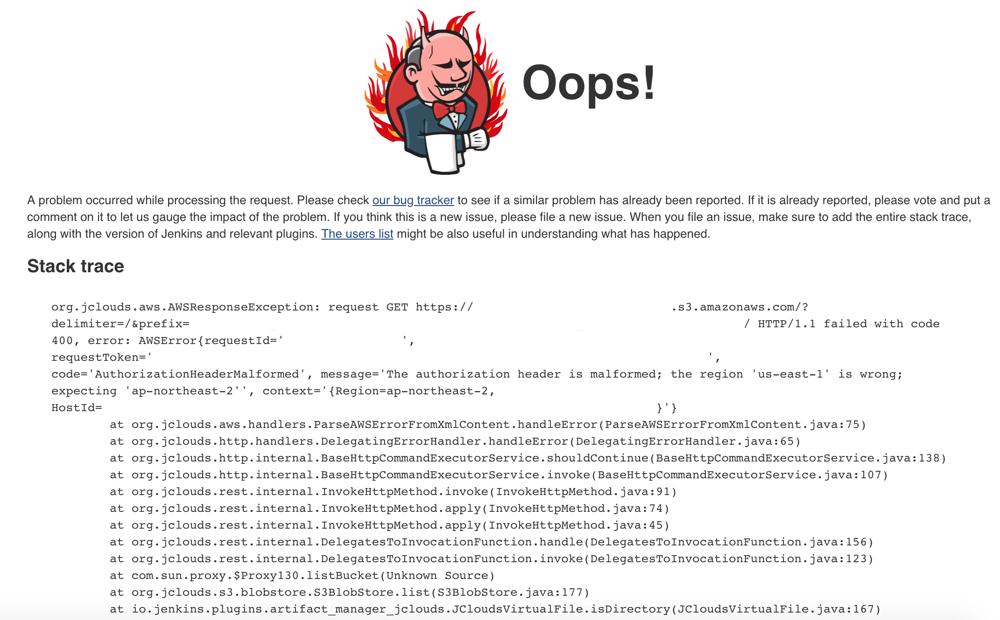

## Artifact Manager

### Environment

Jenkins ver. 2.176.1

[Artifact Manager S3 Plugin](https://wiki.jenkins.io/display/JENKINS/Artifact+Manager+S3+Plugin) ver. 1.6

### Goal

파이프라인이 지워지더라도 Build Artifacts 를 S3 에 백업해 놓으려 함.

### Configuration

1. AWS S3 bucket 생성

2. AWS IAM 에서 read/write policy 가 있는 credential 생성

3. Jenkins 의 AWS credentials 에서 `Access Key ID`, `Secret Access Key` 를 추가

    

4. Manage Jenkins - AWS 에서 `S3 Bucket Name`, `Amazon Credentials` 설정

    

5. Manage Jenkins - Configure System - `Artifact Management for Builds` 에서 `Amazon S3` 를 `Cloud provider` 로 설정

    

### Troubleshooting

- `Validate S3 Bucket configuration` 하면 [에러](https://issues.jenkins-ci.org/browse/JENKINS-57317) 가 발생 하지만 upload 에는 문제 없어 보임
  ```
  GetBucketLocation failed (show details)
  ```

- 그 이후 S3 에는 잘 올라갔으나, download 하려고 하면 `Oops!` 에러 발생.

  

  생각지도 못한 상황이라 당황 했지만, `Amazon Credentials` 에서 `Region` 을 `ap-northeast-2` 인 `Asia Pacific (Seoul)` 로 바꿔서 해결.

### Reference

- https://github.com/jenkinsci/artifact-manager-s3-plugin/blob/master/README.md
