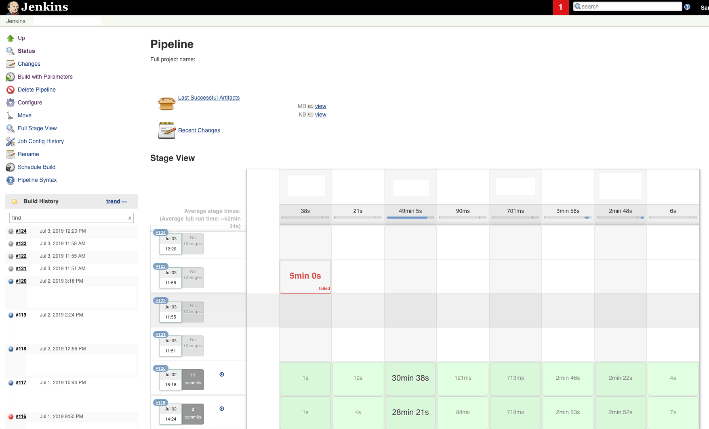
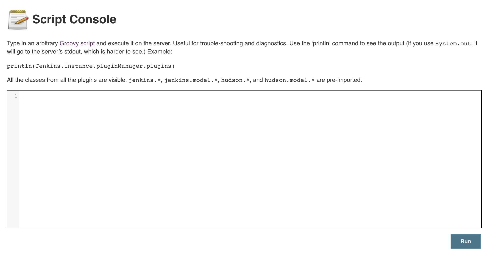

## Build Number

### Environment

Jenkins ver. 2.176.1

### Background



빌드 파이프라인 중 하나가 알 수 없는 이유로 망가졌다.

이슈를 빠르게 대응해야 해서 자세하게 살펴보지는 못했고, 

Jenkins 를 restart 하기엔 다른 팀도 쓰고 상황이라 기존 Job 을 복사해서 다시 만드려고 했다.

그런데 클라이언트 버전이 Job 의 Build Number 를 쓰도록 되어 있어서 (~~dependency~~)

새로 만들 Job 의 Build Number 를 #150 정도로 바꿔야했다.

### Action

Manage Jenkins - Script Console



```
Jenkins.instance.getItemByFullName("__JOB_NAME__").updateNextBuildNumber(150)
```

(`__JOB_NAME__` 은 `Full project name` 을 입력해야 한다)

### Aftermath

다른 사람들에게 혼동을 주지 않으려고 새로 만들 Job 의 이름을 같게 하기 위해

기존 Job 을 지우고 새로 만든 것을 Rename 했었는데, Artifacts 가 날라가는 상황이 발생했다.

=> 빠른 시일 내로 빌드 결과물을 S3 에 올리는 작업을 추가할 예정

=> [Artifact Manager](./Artifact_Manager.md)
