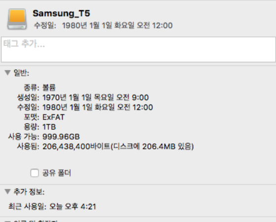

## External SSD

### Background

Jenkins 의 Agent 중 하나가 용량이 적어서 [Samsung Portable SSD T5](https://www.samsung.com/semiconductor/minisite/ssd/product/portable/t5/) 1T 를 설치했는데, **permission** 문제가 발생

### Error Message

```
@@@@@@@@@@@@@@@@@@@@@@@@@@@@@@@@@@@@@@@@@@@@@@@@@@@@@@@@@@@
@         WARNING: UNPROTECTED PRIVATE KEY FILE!          @
@@@@@@@@@@@@@@@@@@@@@@@@@@@@@@@@@@@@@@@@@@@@@@@@@@@@@@@@@@@
Permissions 0777 for '/Users/XXXXX/jenkins_workspace/workspace/YYY/ZZZZZ@tmp/jenkins-gitclient-ssh0123456789.key' are too open.

It is required that your private key files are NOT accessible by others.
This private key will be ignored.

Load key "/Users/XXXXX/jenkins_workspace/workspace/YYY/ZZZZZ@tmp/jenkins-gitclient-ssh0123456789.key": bad permissions
```

### Problem

FAT32 나 NTFS 같은 `non-*nix` 계열 File System 은 permission 개념이 없어서, OS 에서 무조건 777로 인식한다고 한다.

그래서 External SSD 의 포맷을 확인해 본 결과 `ExFAT` 로 되어 있었다.



### Action

Applications - Utilities - **Disk Utility.app** 을 열고,

`Erase` 로 format 을 **Mac OS Extended (Mac OS 확장)** 으로 변경 해서 해결.
