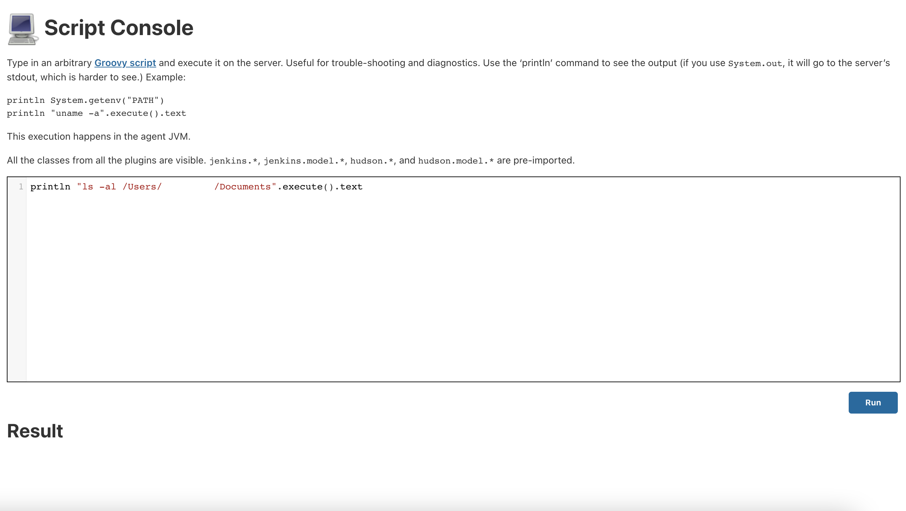
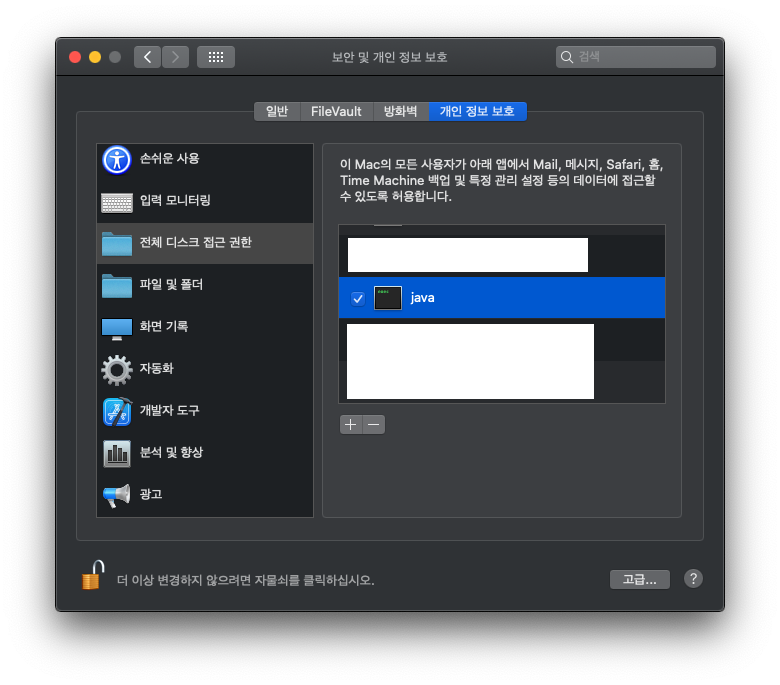

## Full Disk Access

### Environment

Jenkins ver. 2.263.1

macOS Catalina (10.15.7)

git version 2.24 이후

### Background

내부적으로 구현해서 쓰고 있던 gitcache 를 버리고 [git-worktree](https://git-scm.com/docs/git-worktree) 를 적용하려고 하는데, 특정 Build Executor 에서만 `fatal: not a git repository: /Users/XXXXX/Documents/YYYYYY/.git/worktrees/ZZZZ` 에러가 발생.

### Troubleshooting

같은 repository 에 여러 개의 working trees 로 관리. 

(submodules 에도 모두 적용)

```sh
$ git worktree add --detach $WORKSPACE
```

`~/Documents` 에 그 repo 들을 생성하고 몇 번이고 `gitdir` 확인하고 `git init` 도 했으나 에러는 여전히 발생했다.

특정 git (`/usr/local/bin/git`, `/usr/bin/git`, ...) 이나 버전 (`git version 2.27.0`, `git version 2.24.3 (Apple Git-128)`, ...) 때문일까 의심했으나 원인은 아니었다.

SSH 로 접속한 Terminal 에서는 `git checkout` 이 잘 되는데 (`whoami` 로 확인해도 같은 유저였다) 왜 Job 을 실행할 때만 그러는지 열심히 삽질한 결과, macOS 의 권한 문제였다.

문제 되는 Node 의 Script Console.



`macOS Mojave` 이후부터 **Full Disk Access** 라는 security feature 가 생겼는데, application 이 사용자의 파일에 접근하기 위해서는 권한을 받아야 했다.

System Preferences - Security & Privacy - Privacy - Full Disk Access 에서 `java (/usr/bin/java)` 를 추가해서 해결.


