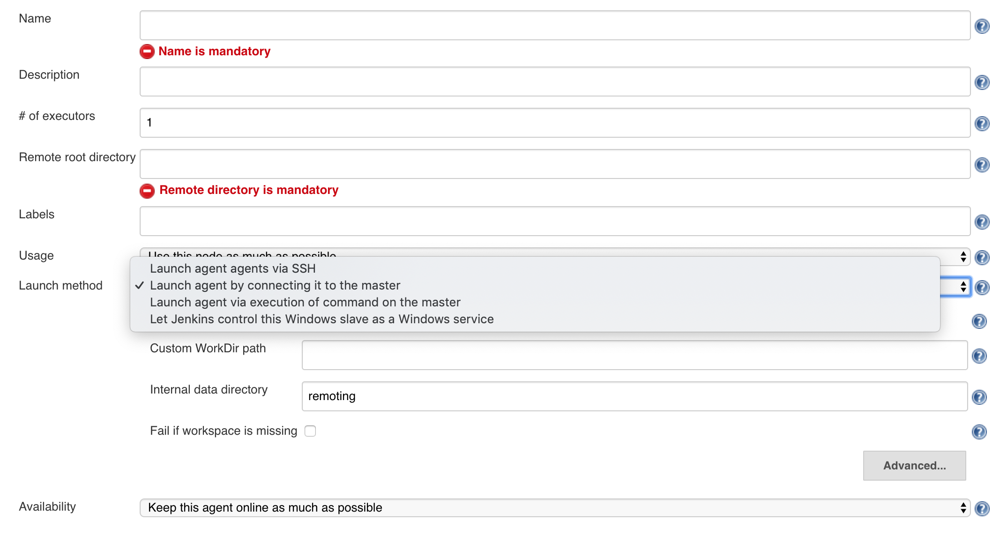

## New node

### Environment

Jenkins ver. 2.176.1

### Getting Started

JNLP (Java Network Launch Protocol) 를 이용

#### MacOS

1. Jenkins - Nodes 에서 `Launch Method` 를 `Launch agent by connecting it to the master` 로 선택 

    

2. `Remote root directory` 설정 (ex. `/Users/XXXXX/jenkins_workspace`)

3. `# of executors`, `Labels` 등 입력 하고 저장

4. `-jnlpUrl` 과 `-secret` 값을 복사

    ```
    Run from agent command line:

    java -jar agent.jar -jnlpUrl __JNLPURL__ -secret __SECRET__ -workDir "/Users/XXXXX/jenkins_workspace"
    ```

5. Node 머신에 접속해서 curl 로 agent.jar 다운로드하고 위치는 적절히 수정

6. `~/Library/LaunchAgents/org.jenkins-agent.plist` 파일을 작성

    ```xml
    <?xml version="1.0" encoding="UTF-8"?>
    <!DOCTYPE plist PUBLIC "-//Apple//DTD PLIST 1.0//EN" "http://www.apple.com/DTDs/PropertyList-1.0.dtd">
    <plist version="1.0">
    <dict>
      <key>KeepAlive</key>
      <true/>
      <key>Label</key>
      <string>org.jenkins-agent</string>
      <key>ProgramArguments</key>
      <array>
        <string>/usr/bin/java</string>
        <string>-Duser.home=/Users/XXXXX/jenkins_workspace</string>
        <string>-Djava.awt.headless=true</string>
        <string>-jar</string>
        <string>/Users/XXXXX/jenkins_workspace/agent.jar</string>
        <string>-jnlpUrl</string>
        <string>_____JNLPURL____</string>
        <string>-secret</string>
        <string>_____SECRET_____</string>
        <string>-workDir</string>
        <string>/Users/XXXXX/jenkins_workspace</string>
      </array>
      <key>RunAtLoad</key>
      <true/>
      <key>StandardOutPath</key>
      <string>/Users/XXXXX/jenkins_workspace/jenkins-agent-out.log</string>
      <key>StandardErrorPath</key>
      <string>/Users/XXXXX/jenkins_workspace/jenkins-agent-err.log</string>
    </dict>
    </plist>
    ```

7. Agent load/unload

    ```
    launchctl load ~/Library/LaunchAgents/org.jenkins-agent.plist

    launchctl unload ~/Library/LaunchAgents/org.jenkins-agent.plist
    ```

8. 동작 하는 지, Jenkins 가 인식하는 지 확인. 잘 안되면 log 파일을 분석

    ```
    launchctl list org.jenkins-agent
    ```
