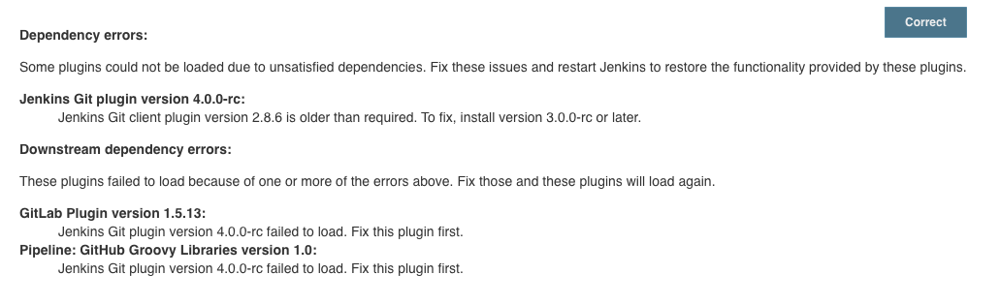
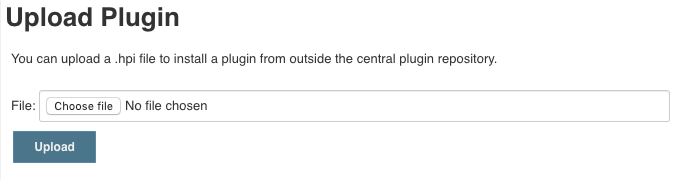
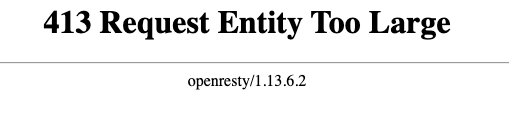

## Plugin

### Environment

Jenkins ver. 2.190.1

Git client plugin 3.0.0-rc

Git plugin 4.0.0-rc

### Background

[Jenkins Security Advisory](https://jenkins.io/security/advisory/2019-09-12/) 을 적용하기 위해

**Git client Plugin** 를 `3.0.0-rc` 에서 `2.8.6` 으로 downgrade 한 뒤, **Git plugin** 을 downgrade 하려 했으나

```
jenkins.InitReactorRunner$1#onTaskFailed: Failed Inspecting plugin /var/jenkins_home/plugins/git.hpi
jenkins.InitReactorRunner$1#onTaskFailed: Failed Loading plugin Jenkins Git plugin v4.0.0-rc (git)
```

Git plugin 을 load 하지 못하면서 dependency errors 가 발생.



### Action

Manage Jenkins - Manage Plugins - Advanced - Upload Plugin 에서



[Git Plugin](https://plugins.jenkins.io/git) latest 3.x release 를 찾아 (`3.12.1`), [hpi 파일](http://updates.jenkins-ci.org/download/plugins/git/3.12.1/git.hpi) 을 upload 하려 했으나



Request Entity Too Large 에러로 실패.

`$JENKINS_HOME.conf` 파일 에서 `client_max_body_size` 를 추가하고 proxy 를 restart

```
server {
  ...
  client_max_body_size 4M;
  ...
}
```

`git.hpi` 을 upload 하니 dependency errors 가 해결.
