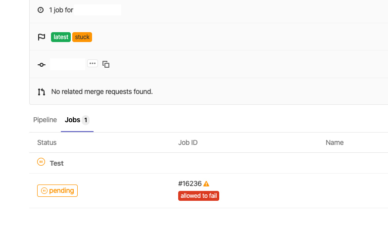
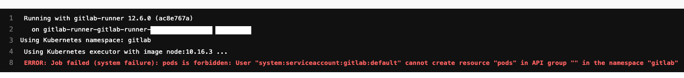
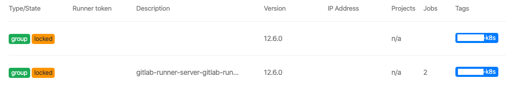

## GitLab Runner

### Background

AWS EC2 위에 **gitlab-runner** 를 설치해서 쓰고 있었는데,

확장성 및 관리를 편하게 하기 위해 Helm 으로 Kubernetes 에 옮기려고 한다.

### AS-IS

- [Follow the documentation](https://docs.gitlab.com/runner/install/linux-repository.html)

    ```sh
    # Install Docker
    curl -fsSL https://get.docker.com | sh

    # For Debian/Ubuntu/Mint
    curl -L https://packages.gitlab.com/install/repositories/runner/gitlab-runner/script.deb.sh | sudo bash

    # For Debian/Ubuntu/Mint
    sudo apt-get install gitlab-runner
    ```

- [Register the Runner](https://docs.gitlab.com/runner/register/index.html)

    ```sh
    # Run the following command:
    sudo gitlab-runner register

    # Enter your GitLab instance URL:
    Please enter the gitlab-ci coordinator URL (e.g. https://gitlab.com )
    https://git.XXXXX.com/

    # Enter the token you obtained to register the Runner:
    Please enter the gitlab-ci token for this runner
    REGISTRATION_TOKEN

    # Enter a description for the Runner, you can change this later in GitLab’s UI:
    Please enter the gitlab-ci description for this runner
    [ip-XXX-XX-XX-XX]: server-gitlab-runner

    # Enter the Runner executor:
    Please enter the executor: ssh, docker+machine, docker-ssh+machine, kubernetes, docker, parallels, virtualbox, docker-ssh, shell:
    docker

    # If you chose Docker as your executor, you’ll be asked for the default image to be used for projects that do not define one in .gitlab-ci.yml:
    Please enter the Docker image (eg. ruby:2.6):
    alpine:latest
    ```

- Configuration

    ```sh
    $ sudo gitlab-runner list
    Runtime platform                                    arch=386 os=linux pid=1234 revision=12345678 version=12.X.0
    Listing configured runners                          ConfigFile=/etc/gitlab-runner/config.toml
    server-gitlab-runner                                Executor=docker Token=REGISTRATION_TOKEN URL=https://git.bagelcode.com/

    $ sudo cat /etc/gitlab-runner/config.toml
    concurrent = 1
    check_interval = 0

    [session_server]
    session_timeout = 1800

    [[runners]]
    name = "server-gitlab-runner"
    url = "https://git.XXXXX.com/"
    token = "REGISTRATION_TOKEN"
    executor = "docker"
    [runners.custom_build_dir]
    [runners.docker]
        tls_verify = false
        image = "alpine:latest"
        privileged = false
        disable_entrypoint_overwrite = false
        oom_kill_disable = false
        disable_cache = false
        volumes = ["/cache"]
        shm_size = 0
    [runners.cache]
        [runners.cache.s3]
        [runners.cache.gcs]
    ```

### TO-BE

- [Helm Client](https://helm.sh/docs/using_helm/#installing-the-helm-client) 설치.

- [gitlab-runner-values.yaml](https://gitlab.com/gitlab-org/charts/gitlab-runner/blob/master/values.yaml) 생성 및 **gitlabUrl & runnerRegistrationToken** 업데이트.

    ```sh
    # Add the GitLab Helm repository:
    helm repo add gitlab https://charts.gitlab.io

    # For Helm 3
    helm install --namespace gitlab gitlab-runner -f gitlab-runner-values.yaml gitlab/gitlab-runner
    ```

### Troubleshooting 1

- GitLab Runner 가 정상적으로 register 됐는데도 Job 이 Stuck 됨.

    

- Group Runner 들을 구분하려고 **tags** 에 **xxxxx-k8s** 라고 추가 했는데, **runUntagged** 의 default values 가 false 라서 tag 가 없는 job 들은 assignment 되지 않았다. **runUntagged** 를 true 로 수정.

    ```yaml
    ## Specify the tags associated with the runner. Comma-separated list of tags.
    ##
    ## ref: https://docs.gitlab.com/ce/ci/runners/#using-tags
    ##
    tags: "xxxxx-k8s"

    ## Specify if jobs without tags should be run.
    ## If not specified, Runner will default to true if no tags were specified. In other case it will
    ## default to false.
    ##
    ## ref: https://docs.gitlab.com/ce/ci/runners/#allowing-runners-with-tags-to-pick-jobs-without-tags
    ##
    runUntagged: true
    ```

### Troubleshooting 2

- 이제 Job 이 pending 에서 넘어 갔으나, default 의 ServiceAccount 에 pods 를 create 할 권한이 없어서 실패

    

- rbac 설정에서 create 를 true 로. resource & verb 를 아래처럼 추가.

    ```yaml
    ## For RBAC support:
    rbac:
    create: true
    ## Define specific rbac permissions.
    resources: ["pods", "pods/exec", "secrets"]
    verbs: ["get", "list", "watch", "create", "patch", "delete"]

    ## Run the gitlab-bastion container with the ability to deploy/manage containers of jobs
    ## cluster-wide or only within namespace
    clusterWideAccess: false

    ## Use the following Kubernetes Service Account name if RBAC is disabled in this Helm chart (see rbac.create)
    ##
    # serviceAccountName: default
    ```

- 해결

    

### Reference

- https://docs.gitlab.com/runner/install/kubernetes.html
