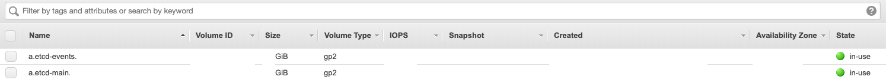
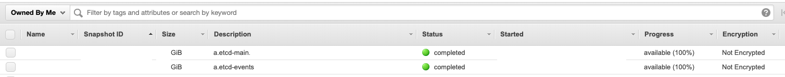

## Kubernetes 1.12

### Background

[kops](https://github.com/kubernetes/kops) 를 이용해 k8s `1.11.6` -> `1.12.10` 로 upgrade 를 진행.

기본적으로는 [Upgrading Kubernetes](https://github.com/kubernetes/kops/blob/master/docs/upgrade.md) 를 따라 하면 되지만,

[Release notes](https://github.com/kubernetes/kops/blob/master/docs/releases/1.12-NOTES.md) 를 보면 etcd3 로 migration 이 필요.

### Walkthrough

1. Install **kops** & **kubectl**
    
    ```
    $ curl -LO https://github.com/kubernetes/kops/releases/download/1.12.3/kops-darwin-amd64
    $ mv kops-darwin-amd64 kops_1.12.3
    $ chmod +x ./kops_1.12.3
    $ sudo mv ./kops_1.12.3 /usr/local/bin/

    $ curl -LO https://storage.googleapis.com/kubernetes-release/release/v1.12.0/bin/darwin/amd64/kubectl
    $ chmod +x ./kubectl
    $ sudo mv ./kubectl /usr/local/bin/kubectl
    ```

2. 백업을 위해 **etcd main/events** 의 EBS volumes snapshots 생성: 15분 정도 소요 (~~악몽 방지~~)

    

    

3. Upgrade & Update cluster
    
    ```bash
    $ kops_1.12.3 upgrade cluster
    $ kops_1.12.3 upgrade cluster --yes

    $ kops_1.12.3 update cluster
    $ kops_1.12.3 update cluster --yes
    ```
    
    <details>

      ```
      ITEM				    PROPERTY		    OLD								                            NEW
      Cluster				    KubernetesVersion	1.11.6								                        1.12.10
      InstanceGroup/master    Image			    kope.io/k8s-1.11-debian-stretch-amd64-hvm-ebs-2018-08-17    kope.io/k8s-1.12-debian-stretch-amd64-hvm-ebs-2019-08-16
      ...

      Will create resources:
        Keypair/etcd-clients-ca
            Subject             	cn=etcd-clients-ca
            Type                	ca
            Format              	v1alpha2

        Keypair/etcd-manager-ca-events
            Subject             	cn=etcd-manager-ca-events
            Type                	ca
            Format              	v1alpha2

        Keypair/etcd-manager-ca-main
            Subject             	cn=etcd-manager-ca-main
            Type                	ca
            Format              	v1alpha2

        Keypair/etcd-peers-ca-events
            Subject             	cn=etcd-peers-ca-events
            Type                	ca
            Format              	v1alpha2

        Keypair/etcd-peers-ca-main
            Subject             	cn=etcd-peers-ca-main
            Type                	ca
            Format              	v1alpha2

        ManagedFile/etcd-cluster-spec-events
            Location            	backups/etcd/events/control/etcd-cluster-spec

        ManagedFile/etcd-cluster-spec-main
            Location            	backups/etcd/main/control/etcd-cluster-spec

        ManagedFile/manifests-etcdmanager-events
            Location            	manifests/etcd/events.yaml

        ManagedFile/manifests-etcdmanager-main
            Location            	manifests/etcd/main.yaml

        ManagedFile/YOUR.CLUSTER.NAME-addons-dns-controller.addons.k8s.io-k8s-1.12
            Location            	addons/dns-controller.addons.k8s.io/k8s-1.12.yaml

        ManagedFile/YOUR.CLUSTER.NAME-addons-kube-dns.addons.k8s.io-k8s-1.12
            Location            	addons/kube-dns.addons.k8s.io/k8s-1.12.yaml

        ManagedFile/YOUR.CLUSTER.NAME-addons-kubelet-api.rbac.addons.k8s.io-k8s-1.9
            Location            	addons/kubelet-api.rbac.addons.k8s.io/k8s-1.9.yaml
        ...
      ```
    </details>

4. [Migrate etcd3](https://github.com/kubernetes/kops/blob/master/docs/etcd3-migration.md)

    ```bash
    # Roll masters as quickly as possible
    
    $ kops_1.12.3 rolling-update cluster --cloudonly --instance-group-roles master --master-interval=1s
    $ kops_1.12.3 rolling-update cluster --cloudonly --instance-group-roles master --master-interval=1s --yes

    # Roll nodes normally
    
    $ kops_1.12.3 rolling-update cluster
    $ kops_1.12.3 rolling-update cluster --yes
    ```

    non-production clusters 에는 `Mitigating Workload Downtime` 를 빼먹고 안 했었는데,

    production clusters 에는 Temporary Policy 를 만들고 rolling-update 를 진행.

    ```bash
    # Configure your master_node_role_name (Generally "masters.your.cluster.name")
    masters_role_name="masters.<your.cluster.name>"

    # Install a temporary IAM policy. This avoids nodes being removed from LoadBalancer type services while masters reconcile the state of the cluster.
    aws iam put-role-policy \
    --role-name "${masters_role_name}" \
    --policy-name temporary-etcd-upgrade-deny-lb-changes \
    --policy-document \
        '{"Version": "2012-10-17", "Statement": [{"Action": ["elasticloadbalancing:DeregisterInstancesFromLoadBalancer", "elasticloadbalancing:DeregisterTargets"], "Resource": ["*"], "Effect": "Deny"}]}'

    # Once your cluster node states have stabilized from `NotReady` to `Ready` you can remove the temporary policy from your master nodes
    aws iam delete-role-policy \
    --role-name "${masters_role_name}" \
    --policy-name temporary-etcd-upgrade-deny-lb-changes
    ```

    rolling-update 를 할 때 instance 하나당 6분 이상 소요됨. (점검 시간 계산할 때 참고)

    <details>

      ```
      instancegroups.go:358] Waiting for 1m30s for pods to stabilize after draining.
      instancegroups.go:198] waiting for 4m0s after terminating instance
      ```
    </details>

5. `etcd-manager` 가 생성 됐는지 확인

    ```bash
    $ kubectl get pod -n kube-system
    ```

    <details>
    
      ```
      NAME                                                                  READY   STATUS    RESTARTS   AGE
      ...
      etcd-manager-events-ip-XX-XXX-XX-XXX.us-west-2.compute.internal       1/1     Running   0          Nm
      etcd-manager-main-ip-XX-XXX-XX-XXX.us-west-2.compute.internal         1/1     Running   0          Nm
      ...
      ```
    </details>

6. 잘 되는 듯 😎
