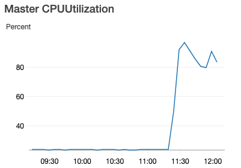
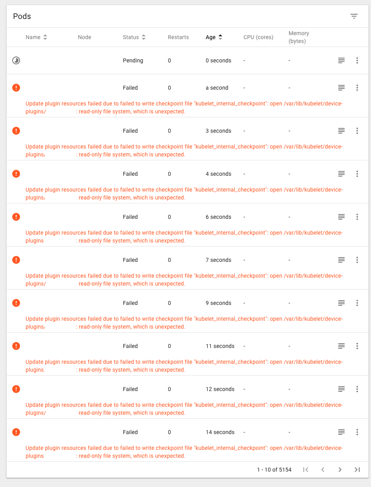
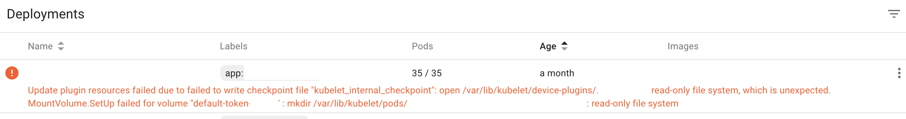
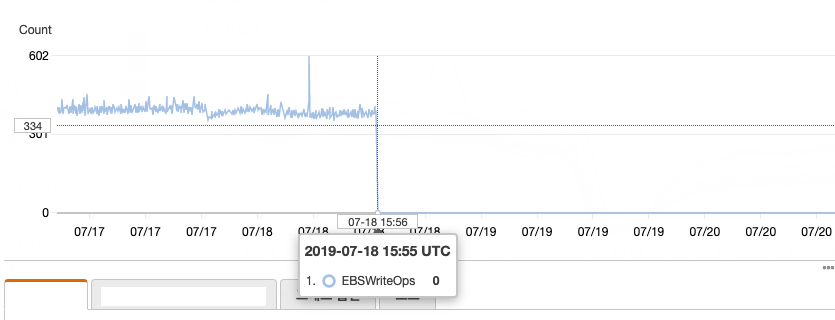

## Read-Only File System

### Background

rolling-update 로 deploy 하는데, **k8s master CPUUtilization** 가 튀기 시작했다.



pods 가 제대로 생성되지 못해서, 수천 개가 만들어지고 있었다.

### Error

k8s dashboard 를 보니 **read-only file system** 에러.

(7월, 8월에 한 번씩 두 번이나 겼었다. 🙃)

July, 2019



August, 2019



### Action

하나의 노드에서만 발생 했던 문제라서, 아래 방법들로 해결 했었다.

- 노드를 교체 (minSize, maxSize 를 늘렸다기 다시 줄이기)

```bash
$ kops edit ig __INSTANCE_GROUPS__
```

- cordon & drain

```bash
$ kubectl drain __NODE__ --ignore-daemonsets
```

### Cause

찾아보니 File System 이 깨져서 read-only 로 되면서 발생한 문제가 유력한 설명인 듯 하다.

`EBSWriteOps` 를 보면 0 으로 로그도 남지 않고, 파일을 못 쓰고 있지 않았을까.




### Thought

Launch Time 이 `February 22, 2019` 였던 Instances 들이 문제였던 것 같다.

### TODO

각 노드들이 잘 write 하고 있는지 모니터링 추가해서 alert 를 받아야 한다.

### Reference

- https://kubernetes.io/docs/reference/kubectl/cheatsheet/

- https://github.com/kubernetes/kops/blob/master/docs/instance_groups.md
