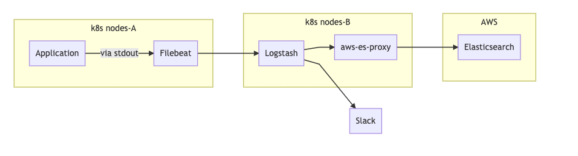
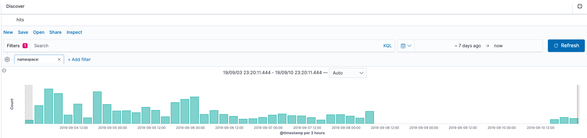
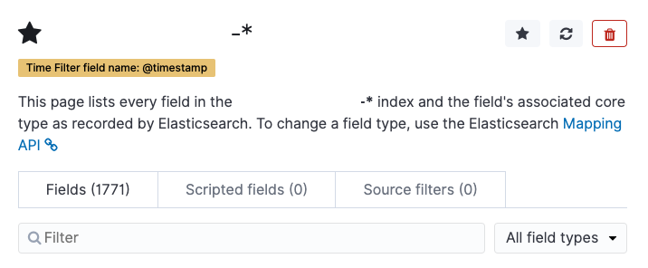

## Log

### Environment

[Filebeat 6.6.2](https://www.docker.elastic.co/#filebeat-6-6-2-)

[Logstash 6.4.0](https://www.docker.elastic.co/#logstash-6-4-0-)

[AWS Elasticsearch version 7.1](https://aws.amazon.com/about-aws/whats-new/2019/08/amazon-elasticsearch-services-announces-support-for-elasticsearch-versions/)

### Architecture



<details>

<summary> mermaid </summary>

```
graph LR
    subgraph k8s nodes-A
    Application-->|via stdout|Filebeat
    end

    subgraph k8s nodes-B
    Logstash-->aws-es-proxy
    end
   
    subgraph AWS
    Elasticsearch
    end

    Filebeat-->Logstash
    aws-es-proxy-->Elasticsearch
    Logstash-->Slack
```
</details>

### Background

다른 팀으로부터 특정 시각 이후 에러 로그가 슬랙으로는 오는데, 키바나에서는 볼 수 없다고 제보 받았다.



확인해 본 결과 19/09/08 08:59:37.283 (KST) 이후로, document 를 찾을 수 없었다.

이건 Logstash 의 문제라고 판단하고 pods 를 delete 하고 새로 만들었더니,

그 이후 19/09/10 17:50:30.672 (KST) 부터는 Elasticsearch 로 잘 들어오기 시작했다. (~~왜 그럴까~~)

### Error

제대로 해결하기 위해서 Logstash pods 에 있던 로그들을 분석.

```
elasticsearch - Detected a node with a higher major version than previously observed. This could be the result of an elasticsearch cluster upgrade. {:previous_major=>6, :new_major=>7, :node_url=>http://aws-es-proxy:XXXX/}

elasticsearch - Detected a 6.x and above cluster: the `type` event field won't be used to determine the document _type {:es_version=>7}
```

August 17 에 AWS ES 를 6.7 에서 6.8 을 거쳐 7.1 로 upgrade 했었다.

근데 왜 저 때 부터 ES 에 쌓이지 않았을까 🤔

```
elasticsearch - Could not index event to Elasticsearch.
{
  :status=>400,
  :action=>[
    "index", 
    {
      :_id=>nil,
      :_index=>"YYYYY-20190910",
      :_type=>"doc",
      :_routing=>nil
    }, 
    #<LogStash::Event:0x12345678>
  ], 
  :response=>{
    "index"=>{
      "_index"=>"YYYYY-20190910",
      "_type"=>"doc",
      "_id"=>"ZZZZZZZZZZZZZZZZZZZZ",
      "status"=>400,
      "error"=>{
        "type"=>"illegal_argument_exception",
        "reason"=>"Rejecting mapping update to [YYYYY-20190910] as the final mapping would have more than 1 type: [_doc, doc]"
      }
    }
  }
}
```

Elasticsearch 는 explicit type 이 없는 indices 를 `_doc` 로 쓰는데, Logstash 는 `doc` 로 보내서 발생하는 듯 했다.

```
Upgrading to 6.7 is required because the Elasticsearch index template was modified to be compatible with Elasticsearch 7.0 (the _type setting changed from doc to _doc).
```

Version up 하면 해결 될 것 같다고 판단 했고, Elasticsearch 7.1.1 에 compatible 인

[Beats 6.7](https://www.elastic.co/guide/en/beats/libbeat/6.7/upgrading-minor-versions.html) & [Logstash 6.7](https://www.elastic.co/guide/en/logstash/6.7/breaking-changes.html) 로 Upgrade Guide 를 따라 진행 했다.

### Error 2

Error 1 과 별개로 방치된 에러 수정

```
{
  "type"=>"illegal_argument_exception",
  "reason"=>"Limit of total fields [1000] in index [XXXXX-20190909] has been exceeded"
}
```

[index.mapping.total_fields.limit](https://www.elastic.co/guide/en/elasticsearch/reference/master/mapping.html) 의 default value 가 1000 인데, 막 쓰고 있다보니 limit 을 넘겼다.



이전에는 Kibana - Dev Tools - Console 에서 아래처럼 해결 했었는데,

```sh
PUT XXXXX-*/_settings
{
  "index.mapping.total_fields.limit": 2000
}
```

에러날 때 마다 매번 수정할 수 없을테니, template 에 추가 해두고 당분간 잊어 버리기로.

```sh
PUT _template/MY_TEMPLATE
{
  "order" : 0,
  "index_patterns" : [
    "XXXXX-*"
  ],
  "settings" : {
    "index" : {
      "mapping.total_fields.limit" : 2000,
      "number_of_shards" : "N"
    }
  },
  "mappings" : { },
  "aliases" : { }
}
```

### TODO

Filebeat + Logstash 로그들은 따로 보고 있지 않아서, 고민 필요.

### Reference

- https://www.elastic.co/guide/en/elasticsearch/reference/7.1/removal-of-types.html

- https://www.elastic.co/guide/en/logstash/current/plugins-outputs-elasticsearch.html#plugins-outputs-elasticsearch-document_type

- https://www.elastic.co/guide/en/elastic-stack/7.1/upgrading-elastic-stack.html#_stack_version_compatibility
