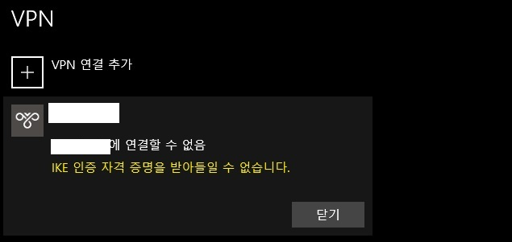
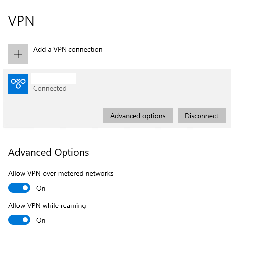

## Certificate

### Error 1


[StrongSwan VPN](https://github.com/Stanback/alpine-strongswan-vpn) 을 쓰고 있는데, 어느 날 이후로 연결 할 수 없었다.

사람마다 에러 메세지가 다르긴 했지만, 결국 **인증서 만료** 문제였다.

### Action

우선 진짜 만료 되었는지 pem 파일로 date 를 찍어봤다.

```bash
$ openssl x509 -dates -noout -in __YOUR_FILE__.pem

notBefore=Apr 9 00:00:00 2018 GMT
notAfter=Apr 8 23:59:59 2020 GMT
```

파일을 wildcard 용으로 교체하고 `ipsec.conf` 의 roadwarrior.leftid 를 수정해서 해결.

### Error 2



2020년 7 ~ 8월 쯤 인증서 새로 발급 받아서 교체 후 **Windows 에서만** IKE authentication credentials are unacceptable 에러로 VPN 에 연결할 수 없었다.

COMODO RSA Domain Validation Secure Server CA 에서 USERTrust RSA Certification Authority 로 변경 되었는데, 당시 `ipsec.d/certs` 랑 `ipsec.d/private` 에 **(Full Chain) CERTIFICATE** 랑 **PRIVATE KEY** 만 추가 했었다.

### Log

```
...
strongswan      | 16[ENC] generating IKE_AUTH response 1 [ EF(1/2) ]
strongswan      | 16[ENC] generating IKE_AUTH response 1 [ EF(2/2) ]
strongswan      | 16[NET] sending packet: from XXX.XX.XX.XX[4500] to XXX.XXX.XX.XX[4500] (1236 bytes)
strongswan      | 16[NET] sending packet: from XXX.XX.XX.XX[4500] to XXX.XXX.XX.XX[4500] (916 bytes)
strongswan      | 06[IKE] sending keep alive to XXX.XXX.XX.XX[4500]
strongswan      | 05[JOB] deleting half open IKE_SA with XXX.XXX.XX.XX after timeout
...
```

### Action

(5.8.0 을 쓰고 있었는데 5.9.0 으로 docker image 를 새로 만들고)

`ipsec.d/cacerts` 에 CA certificate 를 추가하니 해결 됨. 🙃


