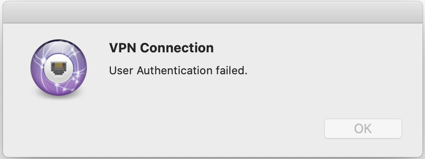

## Certificate

### Background

[StrongSwan VPN](https://github.com/Stanback/alpine-strongswan-vpn) 을 쓰고 있는데, 어느 날 이후로 연결 할 수 없었다.

사람마다 에러 메세지가 다르긴 했지만, 결국 **인증서 만료** 문제였다.

### Error 




### Action

우선 진짜 만료 되었는지 pem 파일로 date 를 찍어봤다.

```bash
$ openssl x509 -dates -noout -in __YOUR_FILE__.pem

notBefore=Apr 9 00:00:00 2018 GMT
notAfter=Apr 8 23:59:59 2020 GMT
```

파일을 wildcard 용으로 교체하고 `ipsec.conf` 의 roadwarrior.leftid 를 수정해서 해결.
