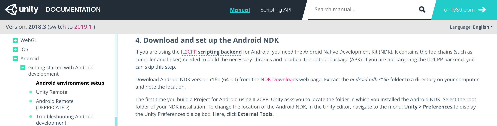
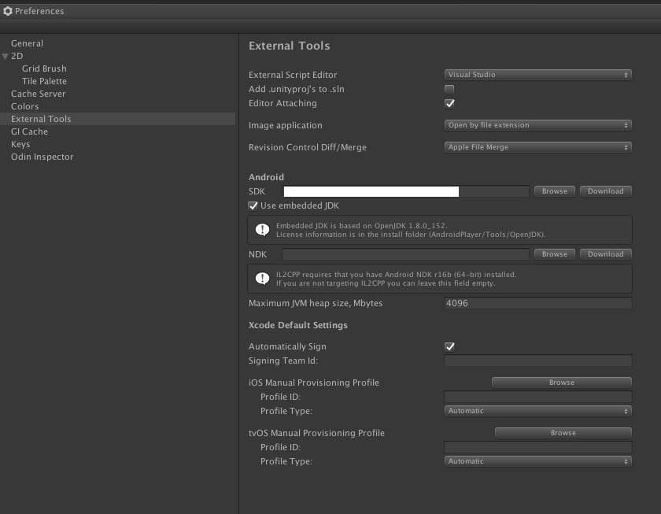

## Android NDK

### Environment

Unity 2018.3.8f1

### Background

- Android NDK

  [Unity Documentation](https://docs.unity3d.com/2018.3/Documentation/Manual/android-sdksetup.html) 을 보면 Android 빌드에 `IL2CPP` scripting backend 를 사용하는 경우, Android NDK(Native Development Kit) 가 필요하다.

  

  그리고 Unity 버전에 따라 필요한 NDK 버전도 다른데, **2018.3** 의 경우 `Android NDK version r16b (64-bit)` 를 다운 받아야 한다.

  (**2018.2** 는 `Android NDK version r13b (64-bit)` 가 필요)

- EditorPrefs.SetString

  Unity > Preferences 의 External Tools 에서 NDK path 를 설정을 해야 하지만
  
  

  `BuildTarget.Android` 일 때 `EditorPrefs` 의 `AndroidNdkRoot` 를 Environment variable (`ANDROID_NDK_HOME`) 로 부터 Set 하는 과정이 있어서 ENV 만 잘 수정하면 된다.

#### Troubleshooting

어느 날 부터 Android 파이프라인에서 Error 가 나면서 실패했다. (Unity 빌드하는 stage)

```
[Package Manager] Server::Kill -- Server was shutdown
Cleanup mono
debugger-agent: Unable to listen on 20
[usbmuxd] Stop listen thread
[usbmuxd] Error: 
[usbmuxd] Listen thread exiting
Checking for leaked weakptr:
  Found no leaked weakptrs.
##utp:{"type":"MemoryLeaks","version":2,"phase":"Immediate","time":1561953607078,"processId":2760,"allocatedMemory":108471525,"memoryLabels":[{"Default":1852},{"Thread":208},{"Manager":608},{"VertexData":221432},{"GfxDevice":9232},{"Audio":80461824},{"Font":21313755},{"Physics":129745},{"Serialization":40},{"Terrain":112},{"String":241708},{"DynamicArray":-80438972},{"HashMap":768},{"Curl":1056},{"PoolAlloc":8},{"Sprites":355930},{"GI":464},{"WebRequest":4150},{"VR":1914},{"Secure":8},{"Image":86081936},{"EditorUtility":396},{"AssetImporter":7472},{"RestService":264},{"License":8},{"UnityConnect":20992},{"Collab":744},{"Upm":53871}]}
Unity build returned with ret code 255.
Unity build returned with non-zero ret code 255.
+ exit 255
```

MemoryLeaks 이라니.. 에러 로그를 봐도 짐작이 안되서 2일 정도 빌드를 하지 못했었는데

로그를 다시 자세히 살펴보니 Android NDK 를 locate 하지 못해서 발생한 에러였다. (~~인생~~)

```
Android PostProcess task "Detecting Android SDK" took 5823.0046 ms
DisplayProgressbar: Detect Android NDK
Uploading Crash Report
UnityException: Android SDK not found
Unable to locate Android NDK.
```

### Action

ENV (`ANDROID_NDK_HOME`) 의 symbolic link 값이 `android-ndk-r13b` 로 되어 있는걸 `android-ndk-r16b` 로 수정

```bash
$ rm android-ndk
$ ln -s android-ndk-r16b android-ndk
```

### Question

Unity 라이센스가 만료 되어서 다시 activate 했을 때 쯤 발생했다.

그 전에는 왜 빌드가 됐는지 설명이 안되지만... (~~Unity 캐싱?~~)
