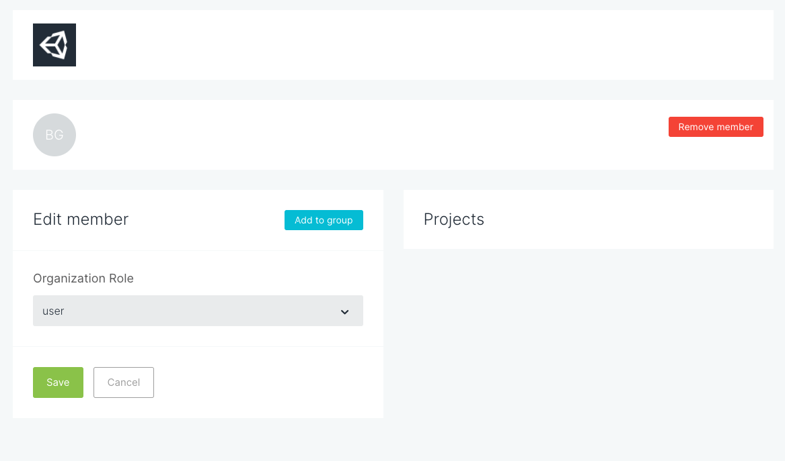
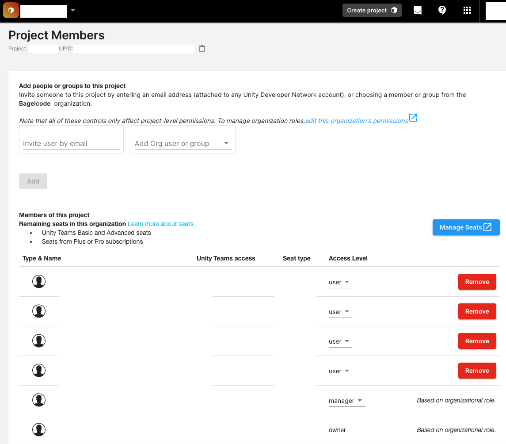

## USYM

### Environment

Unity 2019.2.21f1

### Background

[Fastlane](https://fastlane.tools/) 으로 iOS 빌드를 하는데, [gym](https://docs.fastlane.tools/actions/gym/) Action 에서 에러 발생.

```
The following build commands failed:
	PhaseScriptExecution Process\ symbols /xxxxx/derivedData/Build/Intermediates.noindex/ArchiveIntermediates/Unity-iPhone/IntermediateBuildFilesPath/Unity-iPhone.build/Release-iphoneos/Unity-iPhone.build/Script-XXXC4F70B794F1DCA6C3EXXX.sh

time="2021-04-15T01:14:23+09:00" level=fatal msg="Please provide an auth token with USYM_UPLOAD_AUTH_TOKEN environment variable"
```

### Troubleshooting

몇 년 전에 구매했던 Unity 라이센스가 만료되면서 Google 계정을 새로 만들고 Organization 추가한 뒤 Assign Seat (Serial key 부여) 를 했었다.

그 새로운 계정에서는 Projects 들에 접근을 하지 못해서 `USYM_UPLOAD_AUTH_TOKEN` 값을 빌드할 때 업데이트 하지 못해서 문제가 발생했다.

(Organizations - Members & Groups 에서 member 의 Projects 가 비어 있다)



[Unity 대시보드](https://dashboard.unity3d.com/settings/projects) Settings - Project Members 에서 계정 잘 추가해서 해결.


