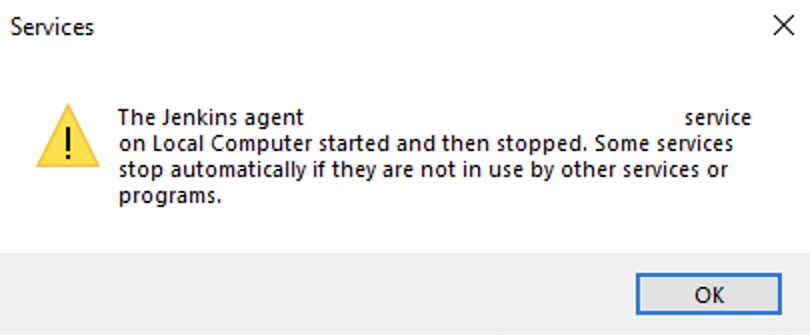
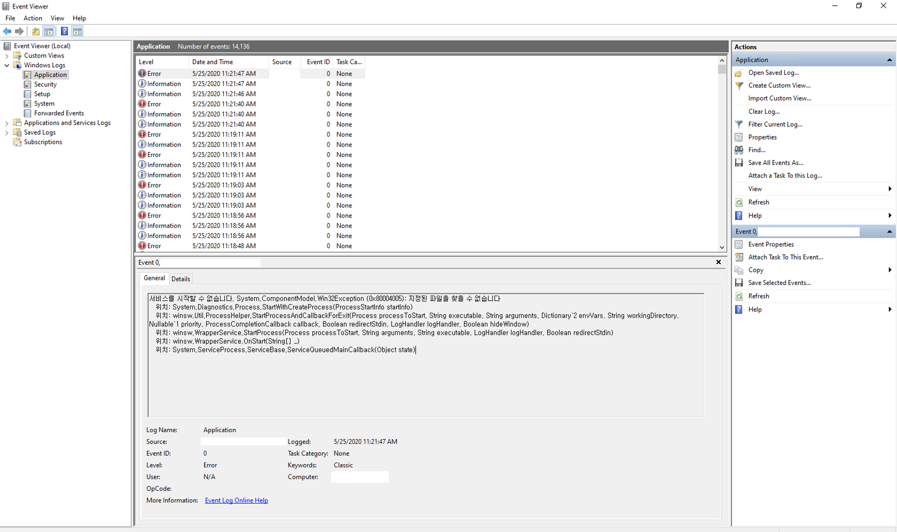

## Services

### Background

Jenkins Agent 중 하나로 Windows 를 쓰고 있는데, JNLP 로 연결할 때 service 로 만들어서 쓰고 있다.

어느 날 부터 master 와 연결이 끊겨서 service 를 직접 실행시키려고 하니 에러가 발생.



```
The XXX service on Local Computer started and then stopped. Some services stop automatically if they are not in use by other services or programs.
```

### Action

**Event Viewer** - Windows Logs - Application 에서 자세한 Error Message 를 볼 수 있었다.



JAVA 를 업데이트 하고 난 후, 이전 버전인 **jre1.8.0_212** 에 접근 하려다가 문제가 발생.

```
INFO - Starting C:\Program Files\Java\jre1.8.0_212\bin\java.exe -Xrs -jar "XXXXX.jar" -jnlpUrl __JNLPURL__ -secret __SECRET__
```
