## Push Certificate

### Dependencies

[OneSignal](https://onesignal.com/)

### Background

구글 캘린더에 기록해 둔 iOS 인증서 만료 날짜 (2019/11/03) 가 얼마 남지 않아서, 갱신하면서 다음을 위해 정리해 두려고 한다. 🙏

### Action

1. **Keychain Access** 에서 인증서 요청 생성 (CertificateSigningRequest.certSigningRequest)

    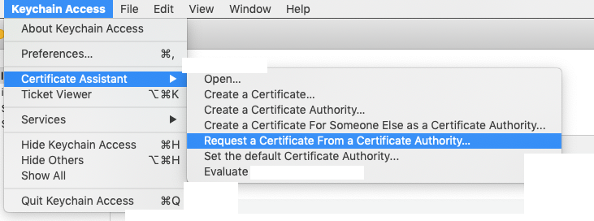

    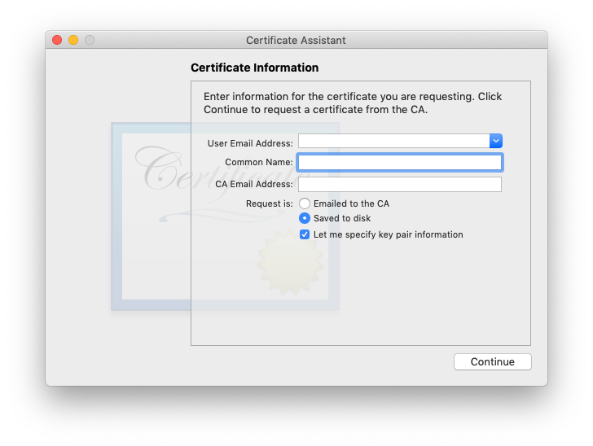

    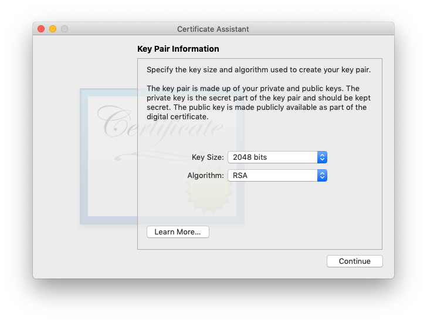

    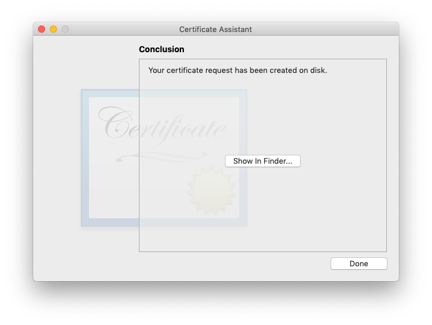

2. [Apple Developer](https://developer.apple.com) - Certificates, Identifiers & Profiles - Identifiers

    원하는 app 을 선택하고 Capabilities 에서 Push Notifications 를 edit

    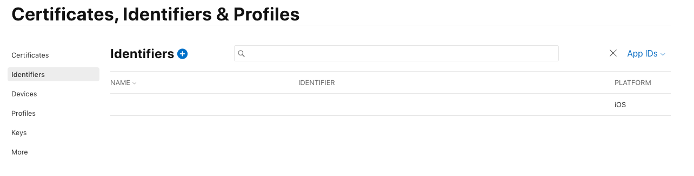

    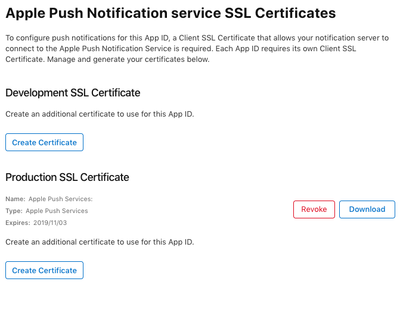

3. Create Certificate 을 누르고 CertificateSigningRequest.certSigningRequest 파일 업로드

    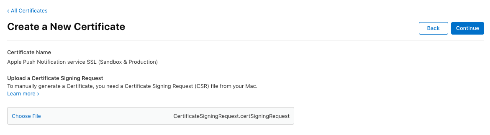

4. 생성된 certificate 를 download

    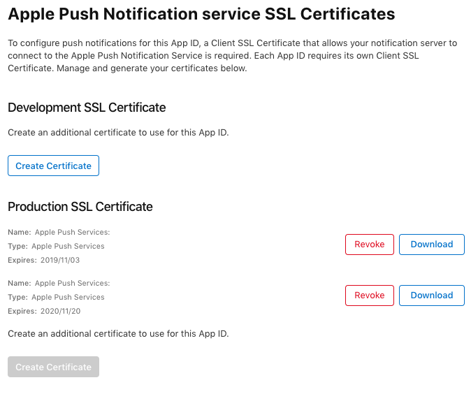

5.  aps.cer 파일을 열고 키체인 등록한 뒤 export 해서 p12 파일 저장

    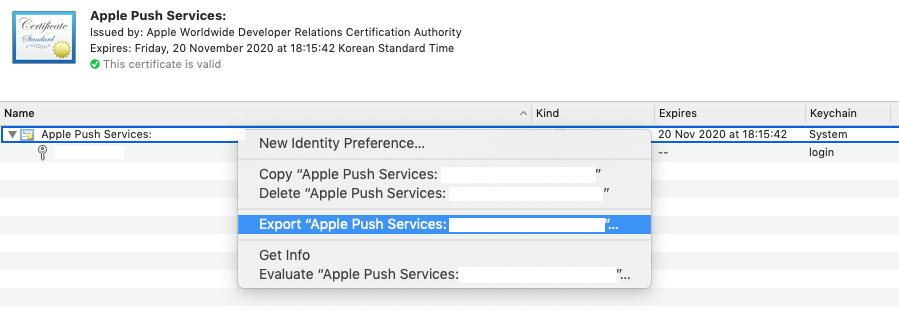

    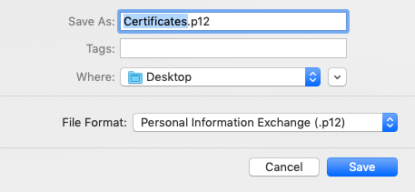

6. OneSignal 에 push certificate 를 upload

    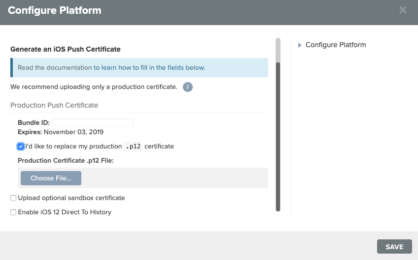

    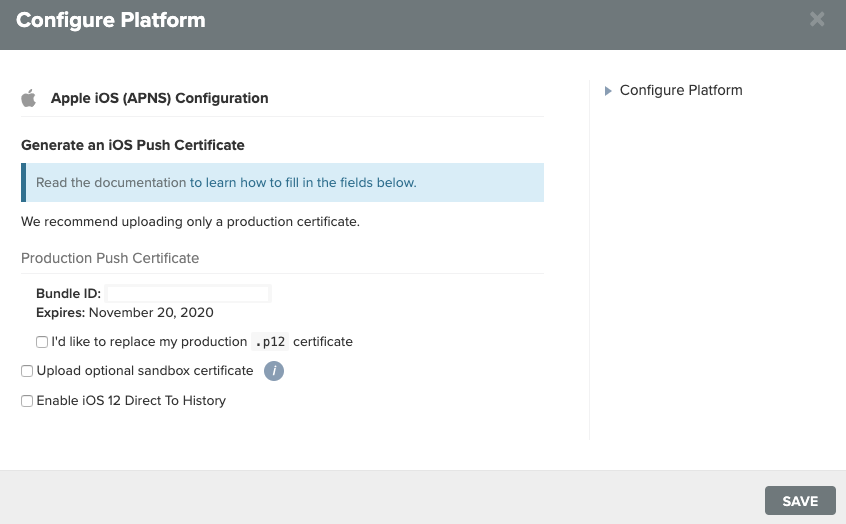

### Reference

- https://documentation.onesignal.com/docs/generate-an-ios-push-certificate